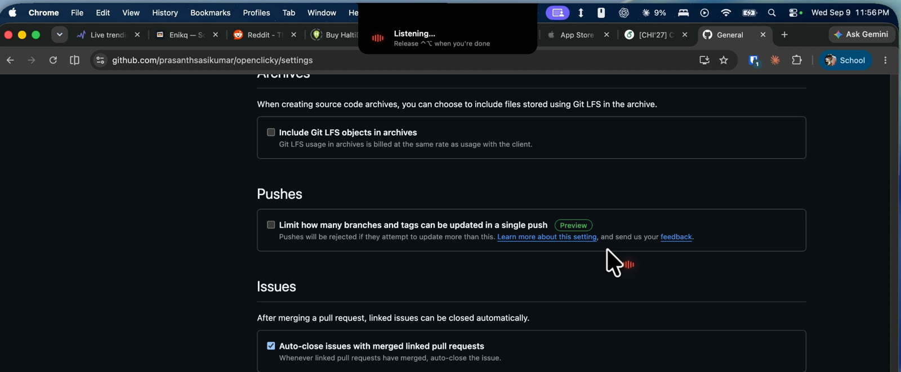
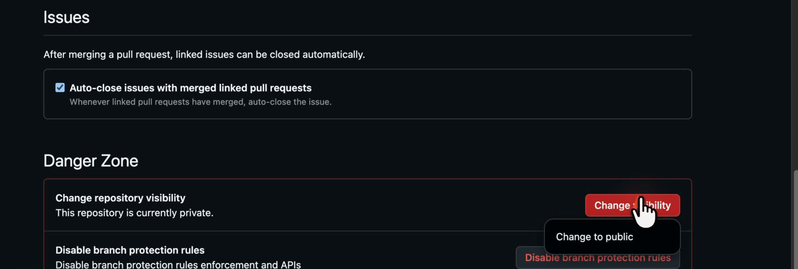
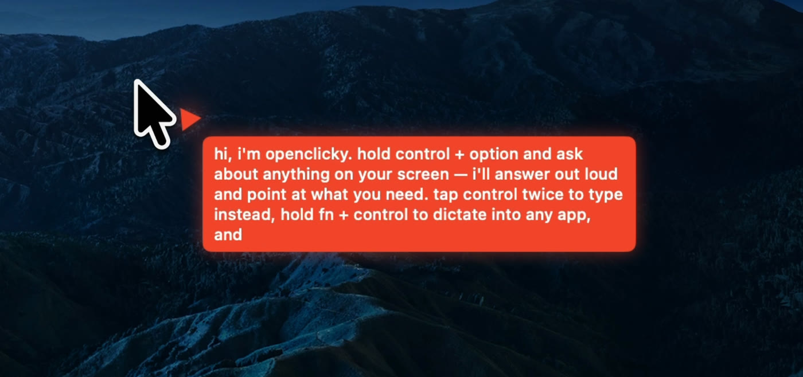
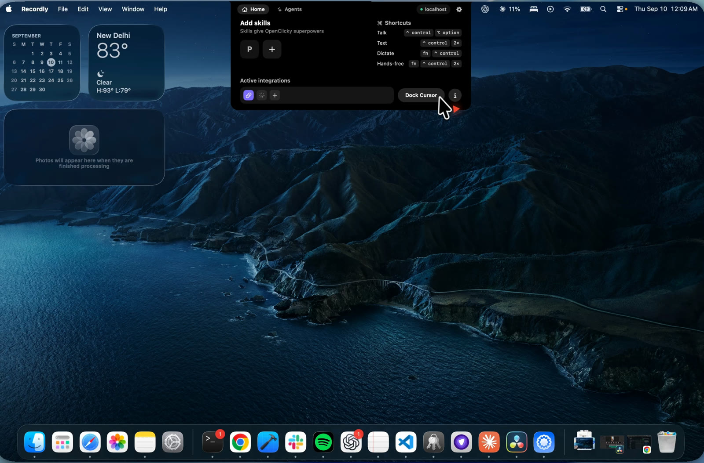
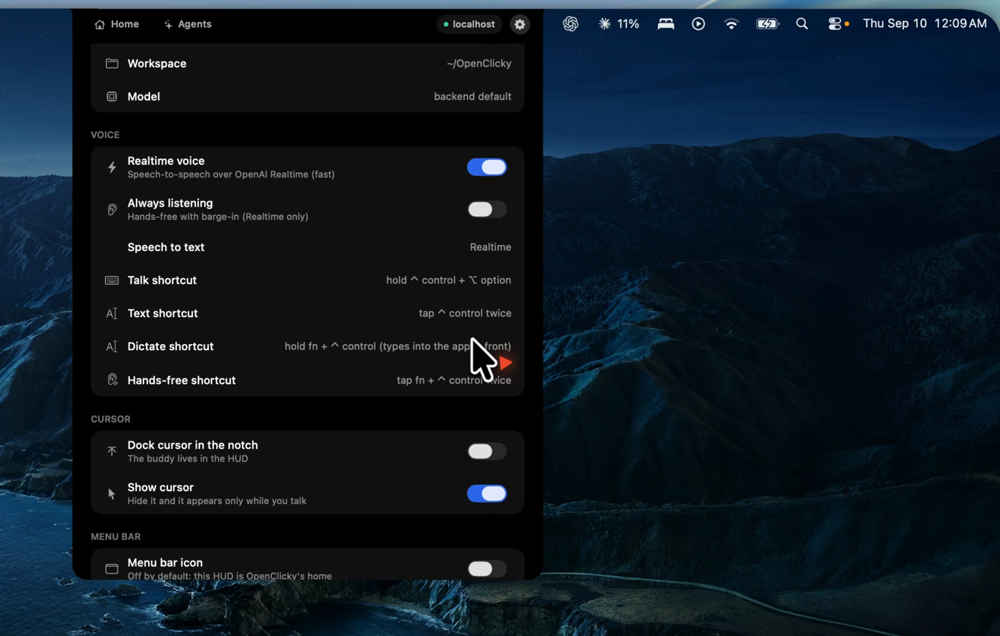

# OpenClicky

**An open-source voice companion for your Mac.** It lives in the notch, sees what is on your screen,
answers out loud, flies a little cursor to the thing you asked about, types what you dictate, and hands
real work to a Codex agent. MIT licensed. Bring your own OpenAI key, or self-host the whole thing.

<a href="https://youtu.be/bWsjCIrmoKA"><b>▶ Watch the demo</b></a> — asking about the screen, being pointed at the answer, and handing real work to the agent.

[**Download OpenClicky for macOS**](https://github.com/prasanthsasikumar/openclicky/releases/latest)
(Apple Silicon, macOS 14.2+, notarized) · [How it works](docs/architecture.md) · [Contributing](CONTRIBUTING.md)

### Try it in three steps

1. Open the dmg, drag OpenClicky to Applications, launch it, and grant Accessibility, Screen Recording,
   and Microphone when asked (it needs all three to see, point, and listen).
2. Hover the notch → Settings → Account → "Use my own API key": add your OpenAI key as `openaiApiKey`
   in the `shell.json` that opens. Your key travels with each request and is never stored anywhere.
   (Hosted accounts without a key are invite-only for now.)
3. Hold **⌃ control + ⌥ option** and ask about anything on screen. Tap **⌃ twice** to type instead,
   hold **fn + ⌃** to dictate into any app, tap **fn + ⌃ twice** for hands-free.

The "do work" lane (files, commands, apps) additionally needs the `openclicky` CLI and
[Codex](https://github.com/openai/codex) on your Mac: see [Run the agent](docs/setup.md#run-the-agent). Without
them, talking, pointing, and dictation all work.

The Mac app is derived from Farza's MIT-licensed [Clicky](https://github.com/farzaa/clicky); HeyClicky
is a separate product and this project is not affiliated with it.

### See it work

| | |
|---|---|
|  |  |
| **Hold ⌃⌥ and ask.** The notch becomes a listening pill over whatever you are looking at. | **It points at the answer.** The buddy flies to the control you asked about, then clicks it if you asked it to. |
|  |  |
| **It answers out loud** and writes the same reply in a bubble next to the buddy. | **The notch is the whole UI:** skills, the four shortcuts, active integrations, and Dock Cursor. |

Settings live in the same HUD — Realtime voice on or off, hands-free listening, the four shortcuts,
and whether the buddy docks in the notch or only appears while you talk.

---

## What is inside

Modeled on the HeyClicky idea, built as a **headless agent core plus a native shell**:

- **`macos/OpenClicky`** — the native shell, a renamed fork of Farza's MIT-licensed Clicky: the
  cursor buddy, ScreenCaptureKit capture, the four shortcuts, in-process OpenAI Realtime voice, and
  an **Agent mode** that hands "make / fix / run…" requests to a Codex thread.
- **`agent/`** — a TypeScript CLI that drives the **OpenAI Codex CLI** over JSON-RPC stdio (the "do
  work" lane), plus the ask lane, a cheap gate that routes between them, screenshots, push-to-talk
  voice, an always-on `talk` loop, and thread management.
- **`backend/`** — a **Hono** API that holds every provider key, verifies **Supabase** auth, proxies
  model calls, mints Realtime voice secrets, transcribes audio, and serves the skill library. Runs on
  Node or Cloudflare Workers unchanged.
- **Skills in three layers** — 15 built-in agent skills, 16 app-teaching skills matched to the app or
  site in front of you, and your own library in `~/.openclicky/skills` (fill it from the HUD, the
  `openclicky skills` CLI, or by hand). The active set reaches both the voice model and the agent.
- **Pointing from Realtime voice** — the voice model gets a `point_at` tool, so "where is the export
  button?" flies the buddy to it while the answer is spoken, one call per step for walkthroughs.

Keys never leave the backend: the agent strips `OPENAI_API_KEY` / `ANTHROPIC_API_KEY` from Codex's
environment and only ever presents the user's token, and the app does the same for the CLI. Pay for
model calls with [your own key or an invite](docs/setup.md#paying-for-model-calls-your-own-keys-or-an-invite).

Not there yet: active-document reading, Composio/cua-driver themselves (only the wiring), HeyClicky's
skill approval queue and team-shared skills, drawing/circling annotations on screen, paywall,
analytics, crash reporting, auto-update.

## Documentation

| Document | What |
|---|---|
| [How it works](docs/architecture.md) | the request flow end to end, repository layout, the three skill layers, following upstream HeyClicky |
| [Setup and running from source](docs/setup.md) | prerequisites, backend, CLI, macOS app, provider choices, keys vs invites, auth flow, releases |
| [Skill authoring](docs/skills.md) | `SKILL.md` format, matching, budgets, activation |
| [`app-skills/`](app-skills/) | the 16 app-teaching skills and how to add one |
| [CONTRIBUTING.md](CONTRIBUTING.md) | setup, test commands, where help is welcome |

## Next

- Shell (`macos/OpenClicky`): stream agent milestones onto the cursor bubble, a text-input mode and
  Keychain token entry (upstream PR #80 is a good template), active-document reader, Sparkle feed
  for our own releases.
- Voice: wake word, spoken task-finished summaries, Deepgram/Whisper STT fallback.
- Backend: `/agent/realtime/turn|warmup`, `/skills/activations/sync` (cross-machine activations), Composio session brokering.
- Skills: the approval queue + "My Skills" filter, team sharing, and more app skills (HeyClicky covers 89 apps).
- Pointing: drawing/circling on screen (HeyClicky's spatial context and hand-drawn annotations).
- Agent: Composio + cua-driver end-to-end once those services are configured; barge-in/always-on voice.

## License and contributing

MIT, see `LICENSE` (the Mac app is derived from Farza's MIT-licensed Clicky; HeyClicky is a separate
product). Everything here runs on your own machine with your own keys; the hosted backend is only a
convenience for invited users. `CONTRIBUTING.md` has the setup, the test commands, and where help is
welcome. Pull requests run the TypeScript and Swift test suites in CI.
