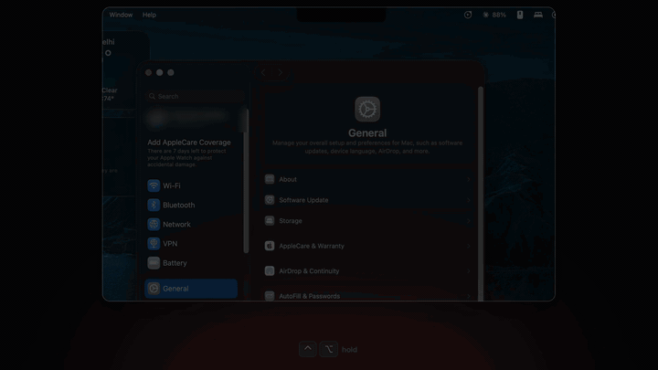
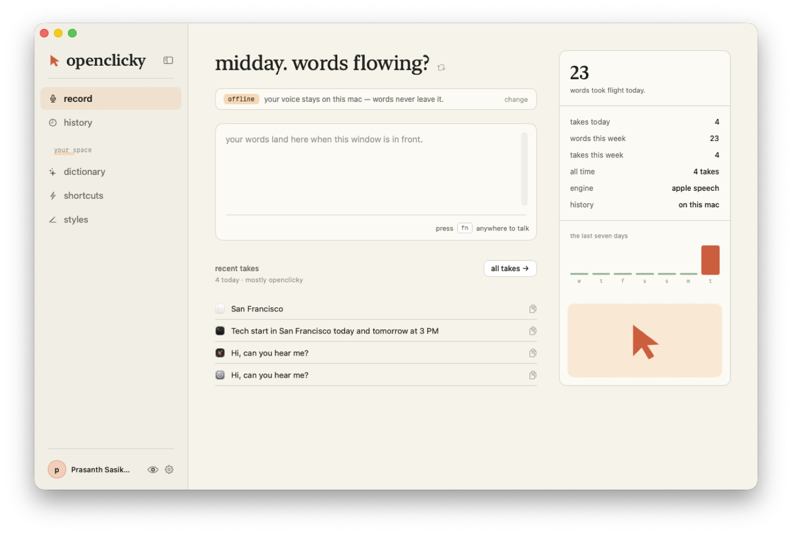
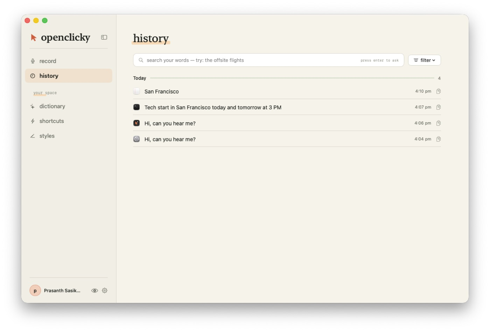
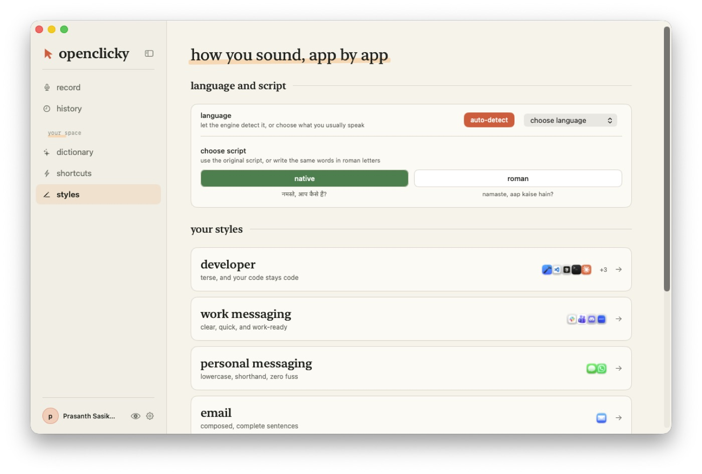
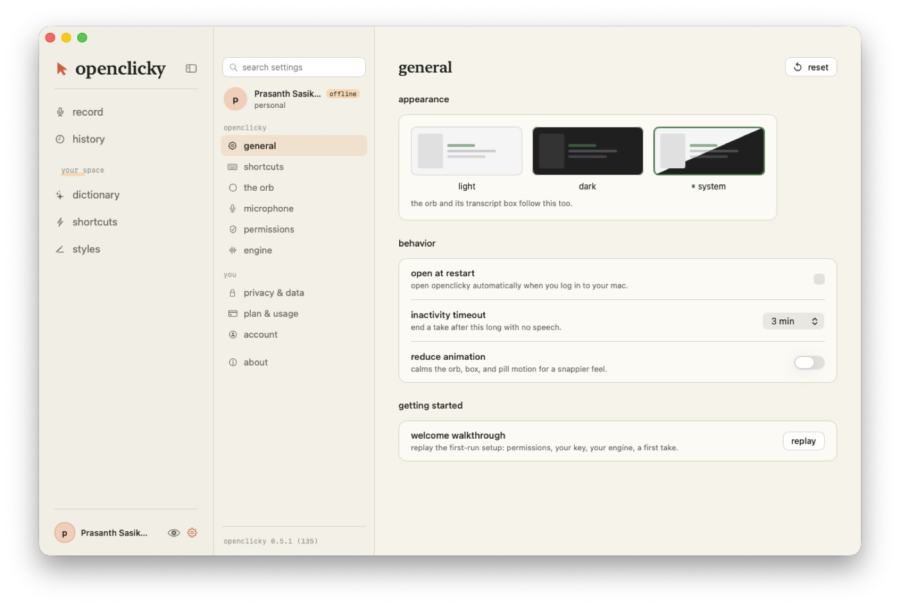
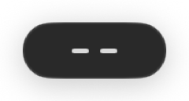
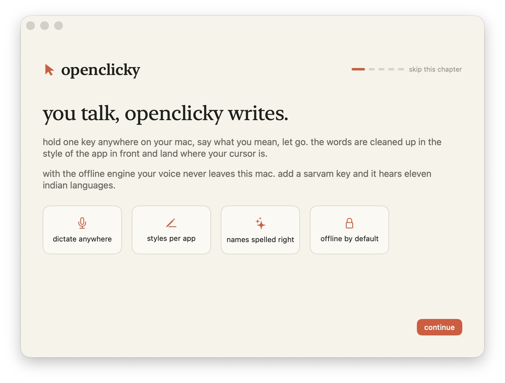

# OpenClicky

**Dictation for your Mac that never has to leave it.** Hold one key anywhere, say what you mean, let
go: the words are cleaned up in the style of the app in front and land where your cursor is. Offline
by default with Apple's on-device recogniser; add your Sarvam key and it hears eleven Indian languages.
And it is still the open-source voice companion it was: hold ⌃⌥ to ask about your screen, be pointed
at the answer, and hand real work to a Codex agent. MIT licensed.

[**Download OpenClicky for macOS**](https://github.com/prasanthsasikumar/openclicky/releases/latest)
(Apple Silicon and Intel, macOS 14.2+, notarized) · [How it works](docs/architecture.md) · [Contributing](CONTRIBUTING.md)

### Try it in three steps

1. Open the dmg and click **Move to Applications** when OpenClicky offers (or drag it there). Grant
   Microphone and Accessibility when the walkthrough asks: the first hears you, the second pastes.
2. Hold **fn** in any text box, say a sentence, let go. It is typed where your cursor is; the orb at
   the bottom of the screen shows every step. Tap fn to start a take and tap again to finish; two quick
   taps or esc discard it.
3. Open OpenClicky (menu bar → open openclicky) for your history, the dictionary ("you say *aditya
   shatriya* → it writes **Aaditya Kshatriya**"), spoken shortcuts ("my sign-off"), and a style per app.

Nothing leaves your Mac until you choose an engine that needs the network (Settings → engine):
**Sarvam** with your own key (Saaras hears Hindi, Tamil, Telugu, Malayalam, Kannada, Bengali, Marathi,
Gujarati, Punjabi, Odia and English, with the words appearing while you speak), or the **OpenClicky** backend with an
invite or your OpenAI key. The same key or account polishes takes with a model (punctuation, "three
p.m." → "3 PM", your style's rules) and powers **Hey Clicky**: hold fn + ⌃, say "make it formal", and
the selected text is rewritten.

### See it work

| | |
|---|---|
|  |  |
| **record.** The engine banner says where your voice goes; takes land in the box when this window is in front. | **history.** Every take with what you said and what was written; type a question and press enter to ask across them. |
|  |  |
| **styles.** Auto-detect or pin a language, native or roman script, and the apps written in each style. | **settings.** General, shortcuts, the orb, microphone, permissions, engine, privacy, plan, account, about. |

The orb rests at the bottom of the screen and shows each take: bars while listening, "moving your
words", "moved to text box". The first run is a five-chapter walkthrough:

### What dictation gives you

| | |
|---|---|
| **The orb** | a pill at the bottom of the screen: resting, listening with live bars, "moving your words", "moved to text box". Three looks, three themes, draggable, can hide when idle. |
| **Styles, app by app** | developer (code stays code), work messaging, personal messaging (lowercase, shorthand), email, other apps. Assign any app to any style; edit the rules the model reads. |
| **Dictionary & shortcuts** | names spelled your way, replaced inside any sentence; shortcuts that expand when you say exactly the trigger. Plain JSON under `~/.openclicky/dictation`. |
| **History** | every take with what you said and what was written, grouped by day, searchable, editable, on this Mac in SQLite. Incognito keeps takes out of it. |
| **Language & script** | auto-detect or pin a language; native script or roman letters for Indian languages. |
| **Installed like an app** | self-installs from the dmg, updates itself (Sparkle), opens at login if you want, frees the fn key from Emoji & Symbols with one click. |

The companion features are unchanged: hold **⌃ control + ⌥ option** and ask about anything on screen,
tap **⌃ twice** to type instead, tap **fn + ⌃ twice** for hands-free. The "do work" lane (files,
commands, apps) additionally needs the `openclicky` CLI and [Codex](https://github.com/openai/codex):
see [Run the agent](docs/setup.md#run-the-agent).

The Mac app is derived from Farza's MIT-licensed [Clicky](https://github.com/farzaa/clicky); HeyClicky
is a separate product and this project is not affiliated with it. The dictation product shape follows
Sarvam's Kivi, studied in [docs/research/2026-10-06-kivi-reverse-engineering.md](docs/research/2026-10-06-kivi-reverse-engineering.md);
no Kivi code, art or fonts are used.

## What is inside

Modeled on the HeyClicky idea, built as a **headless agent core plus a native shell**:

- **`macos/OpenClicky`** — the native app. `Dictation/` is the take loop (the key, the engines, the
  formatter, the paste, the store), the orb, the main window and onboarding; the rest is the shell
  forked from Farza's MIT-licensed Clicky: the cursor buddy, ScreenCaptureKit capture, the
  companion shortcuts, in-process OpenAI Realtime voice, and an **Agent mode** that hands "make /
  fix / run…" requests to a Codex thread.
- **`agent/`** — a TypeScript CLI that drives the **OpenAI Codex CLI** over JSON-RPC stdio (the "do
  work" lane), plus the ask lane, a cheap gate that routes between them, screenshots, push-to-talk
  voice, an always-on `talk` loop, and thread management.
- **`backend/`** — a **Hono** API that holds every provider key, verifies **Supabase** auth, proxies
  model calls, mints Realtime voice secrets, transcribes audio, and serves the skill library. Runs on
  Node or Cloudflare Workers unchanged.
- **Skills in three layers** — 15 built-in agent skills, 16 app-teaching skills matched to the app or
  site in front of you, and your own library in `~/.openclicky/skills` (fill it from the HUD, the
  `openclicky skills` CLI, or by hand). The active set reaches both the voice model and the agent.
- **Pointing from Realtime voice** — the voice model gets a `point_at` tool, so "where is the export
  button?" flies the buddy to it while the answer is spoken, one call per step for walkthroughs.

Keys never leave the backend: the agent strips `OPENAI_API_KEY` / `ANTHROPIC_API_KEY` from Codex's
environment and only ever presents the user's token, and the app does the same for the CLI. Pay for
model calls with [your own key or an invite](docs/setup.md#paying-for-model-calls-your-own-keys-or-an-invite).

Not there yet: active-document reading, Composio/cua-driver themselves (only the wiring), HeyClicky's
skill approval queue and team-shared skills, drawing/circling annotations on screen, a paywall, crash
reporting; on the dictation side, history sync between Macs, teams and a leaderboard, rich paste for
Notion / Sheets / Slack, and Wispr Flow import.

## Documentation

| Document | What |
|---|---|
| [How it works](docs/architecture.md) | the request flow end to end, repository layout, the three skill layers, following upstream HeyClicky |
| [Setup and running from source](docs/setup.md) | prerequisites, backend, CLI, macOS app, provider choices, keys vs invites, auth flow, releases and the update feed |
| [Dictation design](docs/superpowers/specs/2026-10-06-dictation-kivi-port-design.md) | the take loop, engines, formatting, the space, the orb, installation — what was built and why |
| [Kivi, reverse-engineered](docs/research/2026-10-06-kivi-reverse-engineering.md) | the report the dictation product shape was taken from |
| [Dictation hand test](docs/dictation-hand-test.md) | what to try by hand after a build, step by step |
| [Skill authoring](docs/skills.md) | `SKILL.md` format, matching, budgets, activation |
| [`app-skills/`](app-skills/) | the 16 app-teaching skills and how to add one |
| [CONTRIBUTING.md](CONTRIBUTING.md) | setup, test commands, where help is welcome |

## Next

- Dictation: rich paste for Notion / Sheets / Slack, history sync between Macs, Wispr Flow import, a
  Windows client.
- Shell (`macos/OpenClicky`): stream agent milestones onto the cursor bubble, Keychain token entry
  (upstream PR #80 is a good template), active-document reader.
- Voice: wake word, spoken task-finished summaries, Deepgram/Whisper STT fallback.
- Backend: `/agent/realtime/turn|warmup`, `/skills/activations/sync` (cross-machine activations), Composio session brokering.
- Skills: the approval queue + "My Skills" filter, team sharing, and more app skills (HeyClicky covers 89 apps).
- Pointing: drawing/circling on screen (HeyClicky's spatial context and hand-drawn annotations).
- Agent: Composio + cua-driver end-to-end once those services are configured; barge-in/always-on voice.

## License and contributing

MIT, see `LICENSE` (the Mac app is derived from Farza's MIT-licensed Clicky; HeyClicky is a separate
product). Everything here runs on your own machine with your own keys; the hosted backend is only a
convenience for invited users. `CONTRIBUTING.md` has the setup, the test commands, and where help is
welcome. Pull requests run the TypeScript and Swift test suites in CI.
